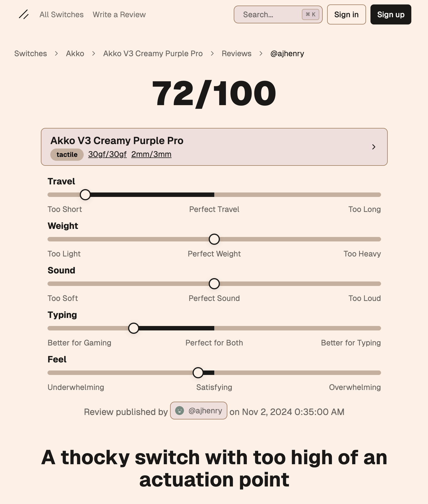

<h1 align="center">
  KeebReviews
</h1>

<h4 align="center">A platform to submit reviews around keyboard switches.</h4>

  <a href="https://keebreviews.com">keebreviews.com</a>

   

## What is it

KeebReviews is a community-driven platform dedicated to mechanical keyboard enthusiasts, focusing on detailed reviews and ratings of various keyboard switches. Users can explore an extensive range of switches, contribute their own reviews, and engage with others in the community to find the best options for their next keyboard build.

## Switch Data

The switch data that powers this website can be found at [ajhenry/switchdb](https://github.com/ajhenry/switchdb).

## Development

1. Get accounts in order to develop.

   Supabase is where the database is stored. You can sign up for a free account at [supabase.io](https://supabase.com/). Once you have an account, create a new project and get the URL and key from the project settings.

2. Get `.env` setup.

   Create a `.env.local` file based on the `.env.example` file. Fill in the values with the information from the previous step.

3. Run `npm install` to install dependencies.
4. Run the development server with `npm run dev`.

There are bound to be bugs so don't be afraid to file an issue.

This project is developed with [Next.js](https://nextjs.org/), [Supabase](https://supabase.com/), and [Tailwind CSS](https://tailwindcss.com/).

## Contributing

All contributions are welcome! Please file an issue or create a pull request.

## License

This is licensed under MIT. See the [LICENSE](LICENSE) file for more information.
